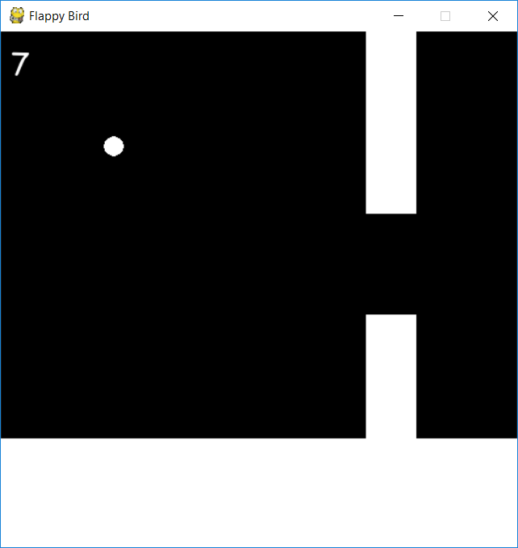

FlappyBirdLike and AI
=====================

Base on this flappy bird like using pygame[1]: https://github.com/sourabhv/FlapPyBird
Follow his instruction to be able to run the game.
You need `numpy` and `pygame` to be able to launch flappy.py. (they are both instalable with `pip`)

Why
---

This is a simple flappybird without any images or welcome screen or what ever. This is made to be able to use AI on it.

I have used a custom and simple neural network. And based the flappy bird on a reinforcement method.

How
---

command : 
`python flappy.py <train | notrain> <filename>`
    `<train | notrain>` specify if you want to launch the game in training mode or not.
    `<filename>`specify the json file where you want to save the best player training brain.

example : 
`python flappy.py train goodplayer.json` will use the goodplayer.json (or create it if it doesn't exist) to populate players based on the same brain and train this population to provide a better brain. This new brain will be stocked in the same file.

`python flappy.py notrain goodplayer.json` will use the goodplayer.json (or create it if it doesn't exist) to create a player with the same brain and just play.

ScreenShot
----------

[1]: http://www.pygame.org
